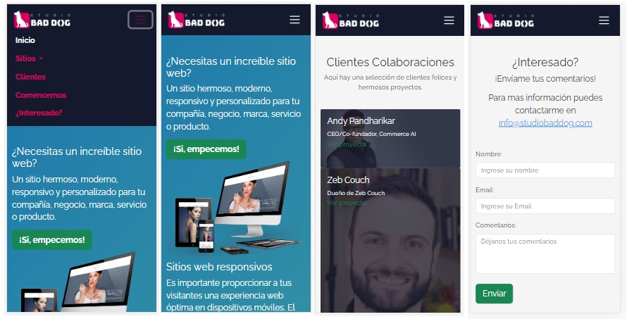
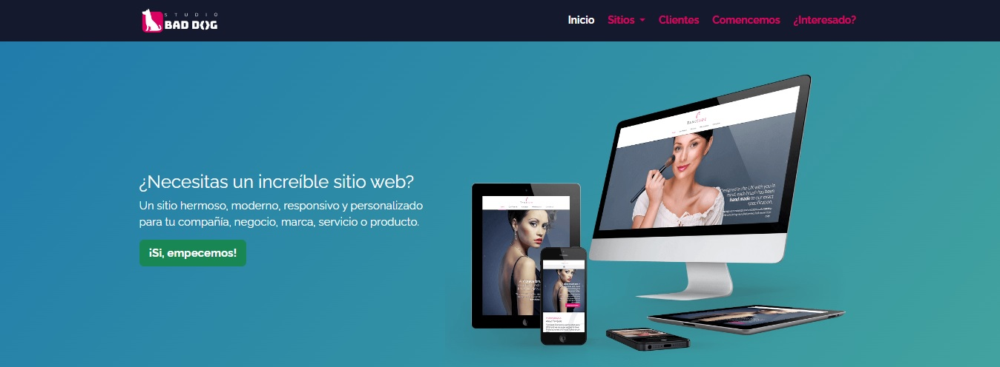
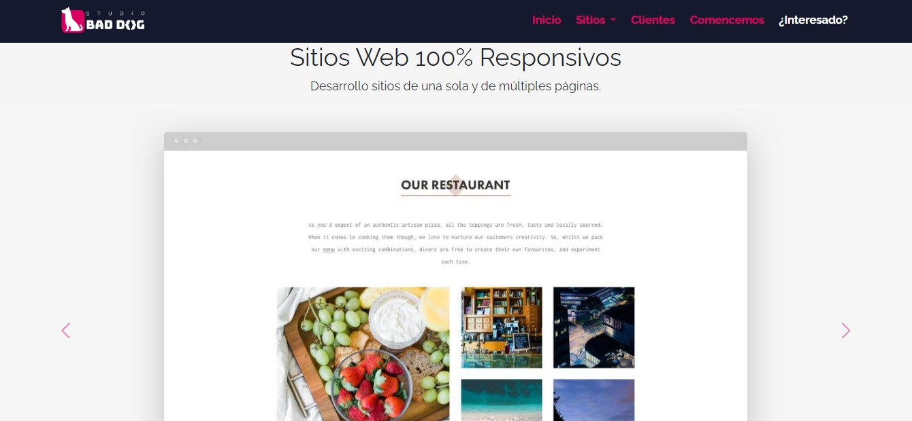

 <h1> WEB DESIGNER </h1> 

STUDIO BADDOG es una empresa de diseño web que ofrece servicios profesionales para crear y desarrollar sitios web atractivos y efectivos. Con un equipo de expertos en diseño y tecnología, BADDOG se dedica a ayudar a sus clientes a mejorar su presencia en línea y lograr sus objetivos de negocio.
 

 
<a href="#descripcion">- Descripcion</a> 
<a href="#imagenes">- Imagenes</a> 
<a href="#tecnologias">- Tecnologias</a> 
<a href="#diseñador">- Diseñador</a> 
<a href="#link">- Link</a> 

# Descripcion
Studio Bad Dog es una empresa de diseño web ficticia con el fin de realizar un proyecto para poner en prácticas diferentes tecnologías y librerías. 
El proyecto está basado en el sitio de [Studio Corvus](studiocorvus.com). 

# Imagenes

## Movile

 

## Desktop

# Tecnologias
Las tecnologías utilizadas para realizar la maquetación de este proyecto fue _html_ y _css_ para los estilos, estas fueron aplicadas mediante un _framework_ **(Bootstrap)** para realizar la practica del mismo. 
Se realizo bajo el concepto Mobile first 

# Diseñador
Pablo Zallio - _Web Designer_
# Link
https://zalliopablo.github.io/studio_bad_dog_proyect